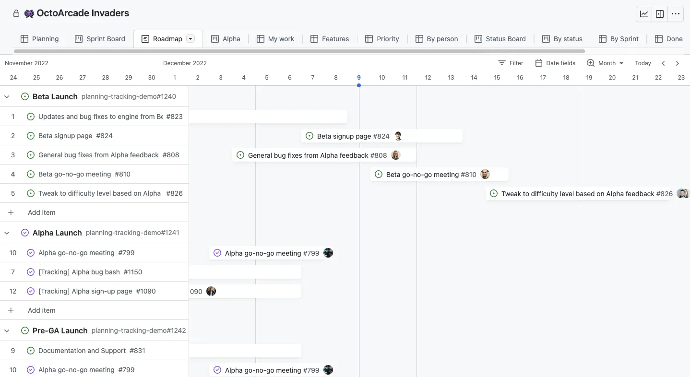

# Fix the Flow - Interactive Website

## Sprint planning

Je begint een project altijd met een sprint planning, dan weet je wat je de komende weken gaat doen en wat er van je wordt verwacht.

## Aanpak

Deze sprint ga je verder met de opdracht. Je gaat de feedback verwerken die je hebt gekregen tijdens de sprint review, en je gaat een interactie leren ontwerpen, bouwen en presenteren aan de opdrachtgever. 

## Planning maken

Teken een schema op het whiteboard voor de komende 3 weken.
Bekijk het programma van Sprint 5 en neem de belangrijke momenten en opdrachten uit het programma op in het schema. 

De sprint review in sprint 5 is de laatste keer dit semester dat je de opdrachtgever spreekt. 
Kan je al bedenken wat je dan wil laten zien? 
Belangrijke momenten zijn ook de code/design reviews op vrijdag, wat wil je dan af hebben? 

Bekijk ook de deeltaken "UI Events" en "JS Fundamentals" die op het programma staan. Bedenk wanneer je hier aan gaat werken en voeg deze toe aan het schema. 

### Repo forken en klaarzetten

Fork en Clone deze leertaak. 
Zet je issues in je nieuwe repo aan en voeg de issues uit de vorige sprint toe aan je nieuwe repo.

Elke sprint schrijf je nieuwe code, ook al blijven onderdelen van de website hetzelfde. 
Zo leer je beter coderen en nettere code schrijven. 

### Projectboard

Koppel het projectboard uit de vorige sprint aan de repository van sprint 5, en voeg de planning van het schema toe.

Als je het projectboard op *Roadmap* zet krijg je een overzicht met je taken en een tijdplanning. Je kan dan de taken een tijdspad geven.

*De Roadmap-view van Github projects geeft een overzicht van taken en tijdsplanning.*

#### Bronnen
[Changing the layout of a view - Github docs](https://docs.github.com/en/issues/planning-and-tracking-with-projects/customizing-views-in-your-project/changing-the-layout-of-a-view)

<!-- 
Voor deze opdracht kies je een User Story waarin een gebruiker iets moet doen, zoals het toevoegen van informatie aan een agenda of stap voor stap door een vragenlijst klikken, een chat-formulier of bijvoorbeeld een filter systeem.  

> Waar kan de klant het meeste feedback op hebben? Waar zijn de grootste risico's en zal er waarschijnlijk het meeste werk in kruipen? - Emiel Van Betsbrugge, Active Theory

Sprint plannen aan de hand van het programma:
JS fundamentals
Deeltaak UI events
I Love Web
CSS challenges en JS challenges
Code design reviews, wat vrijdag afhebben?

-->
